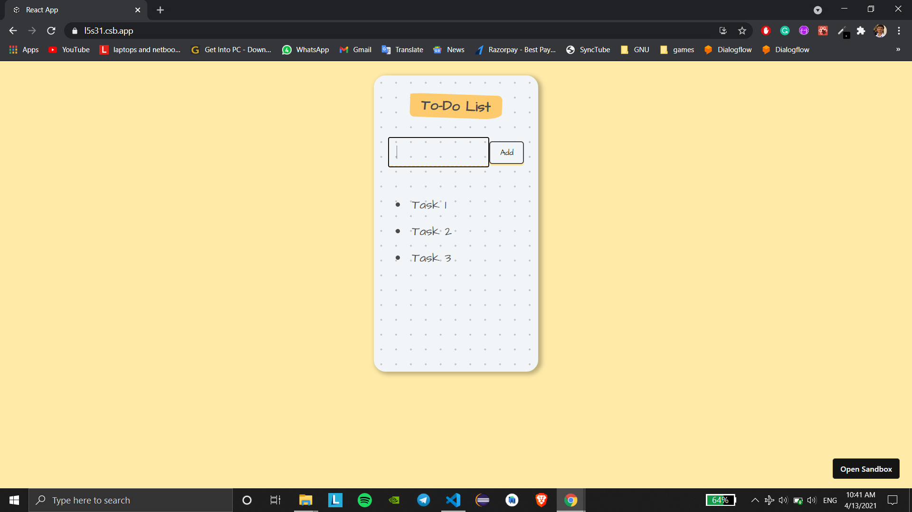

# ToDoList_v2

### It's a Second version of ToDoList [Version1](https://github.com/impruthvi/toDoList)

## 💻&nbsp;Functions

- You can add & delete a notes. 

## How to Run
- You can directly download and run in your device.
- You can also fork this project in codesandbox :- [Click Here](https://codesandbox.io/s/github/impruthvi/ToDoList_v2)

## 🛠 &nbsp;Language and Tools

- 🌐 &nbsp;
  
  
  
  
  

- ⚙️ &nbsp;
  
  
  

- 🔧 &nbsp;
  
  

## 🤝🏻 &nbsp;Connect with Me

